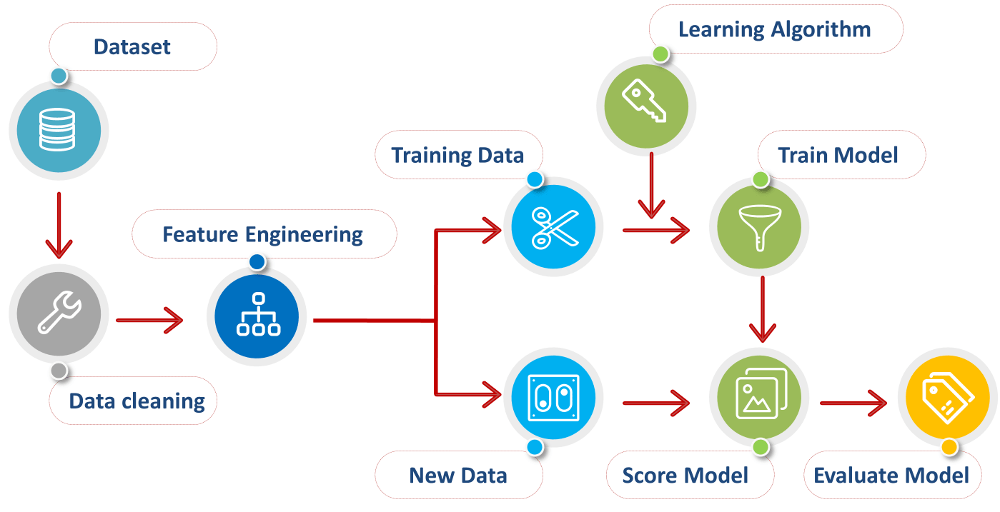
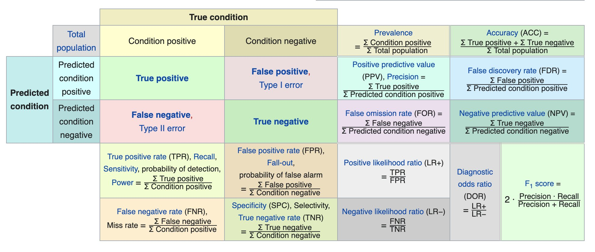

# Machine Learning

What distinguishes a machine learning algorithm from a non-machine-learning algorithm, such as a program that controls traffic lights, is its ability to **adapt** its behaviors to new input.

A **machine learning model** is the outcome of a machine learning algorithm, which can be considered as a function *F*, which outputs certain results, when given the input.

**Samples** are the data sets provided to the algorithm. Each sample can be represented as a tuple of **attributes**. 

## Supervised VS Unsupervised VS Semi-supervised

In **Supervised** learning we have a target attribute known as **ground truth**. The ground truth serves as a teacher to guide the learning task, since it provides a benchmark on the results of learning. The data with a target attribute is often called **"labeled" data**.

In **Unsupervised** we don't have ground truth. We can learn from the following tasks:
- Clustering: cluster the samples into groups, based on the similarities among the samples within the data set.
- Association: uncover the hidden association patterns among the attributes of a sample.

**Semi-supervised** learning is used when the data set is massive but there are few labeled samples. 

By combining **both the supervised and unsupervised** learning in a data set with few labels, one could exploit the data set to a better extend and obtain a better result than just applying each of them individually. 

## Classification VS Regression Model

**Classification:** outputs **discrete** values, e.g. a boolean value.

**Regression:** outputs **continuous** values.

## Process:
1. Import Data
2. Clean the Data
3. **Feature Engineering**: Split the Data into Training/Test Sets
4. Create a Model
5. Train the Model
6. Make Predictions
7. Evaluate and Improve (**hyper-parameter tuning**)

# Underfitting VS Overfitting

**Generalization** measures how well a model derived from the training data can predict the desired attribute of the unseen data. 

An **underfitting** model deviates significantly from the ground truth. One cause is that the model is over-simplified for the data. The algorithm can then be improved to generate a more complex model from the training data set.

An **overfitting** model is the one that fits well with the training data, i.e. little or no error, however it does not generalized well to the unseen data (over-complicated). It can fall into the traps of noises and errors. One possible solution for this problem is to add a **regularization** term to the algorithm, i.e. penalizing the model that is over-complicated so that the algorithm is steered to generate a less complicated model while fitting the data.

## Evaluating the ML Algorithm

For evaluation the following **classification metrics** are used:
- Accuracy: `nr correct predictions / total nr of predictions`
  - Useful when target classes are well balanced
- Recall: `nr true positives / (nr true positives + nr false negatives)`
  - Ability of a model to find all the relevant cases within a dataset
- Precision: `nr true positives / (nr true positives + nr false positives)`
  - Ability of a model to identify only the relevant data points
- F1-Score: `2 * (precision * recall)/(precision + recall) 
  - Finds an optimal blend of precision and recall 

Any classification task outputs either correct or incorrect.

Not all incorrect or correct matches hold equal value in the real world! What constitutes "good" metrics will really depend on the specific situation!

**Confusion Matrix:**
