# LearnComputerVision
Learn Computer Vision and Deep Learning in Python.

Course: Udemy Python for Computer Vision with OpenCV and Deep Learning Course

## Prerequisites

1. Install [conda](https://www.anaconda.com/products/individual)
2. Setup the environment with all the necessary packages:
    > conda env create -f cvcourse_linux.yml
3. Activate your newly created environment
    > conda activate python-cvcourse

[Conda Cheat Sheet](https://docs.conda.io/projects/conda/en/4.6.0/_downloads/52a95608c49671267e40c689e0bc00ca/conda-cheatsheet.pdf)

## 1. NumPy and Image Basics
[NumPy Docs](https://numpy.org/doc/stable/user/quickstart.html)

`.arrange()`: creates `int`

`.zeros()`: creates `float`

**`PIL`:** lib for Images.

**[Matplotlib:](https://matplotlib.org/stable/)** for plotting images.

## 2. Image Basics with OpenCV

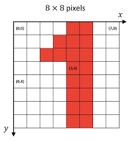

### Differences between Matplotlib and OpenCV

**Matplotlib** : RGB (RED, GREEN, BLUE)

**OpenCV** : BGR (BLUE, GREEN, RED)

## 3. Image Processing


**Color Mappings**

|         RGB         |         HSL         |         HSV         |
| :-----------------: | :-----------------: | :-----------------: |
| 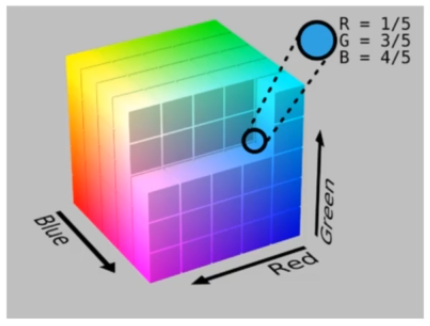 | 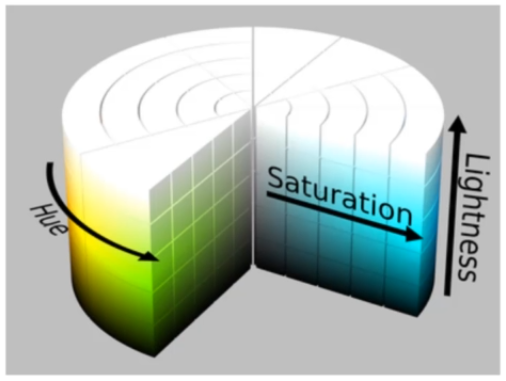 | 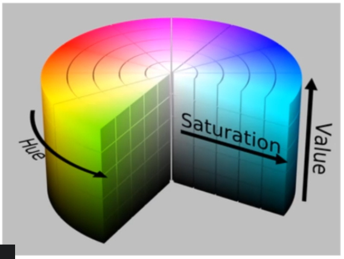 |


### [Adding (blending) two images](https://docs.opencv.org/3.4/d5/dc4/tutorial_adding_images.html): 
- `addWeighted` : if images have the same size
- `bitwise_*` : use bitwise functions to combine information of images with different size
  

### [Thresholding](https://docs.opencv.org/4.x/d7/d4d/tutorial_py_thresholding.html): 
Segment an image into different parts. In case of Binary Threshold it's only 2 parts, white and black. [ThresholdTypes](https://docs.opencv.org/4.x/d7/d1b/group__imgproc__misc.html#gaa9e58d2860d4afa658ef70a9b1115576)

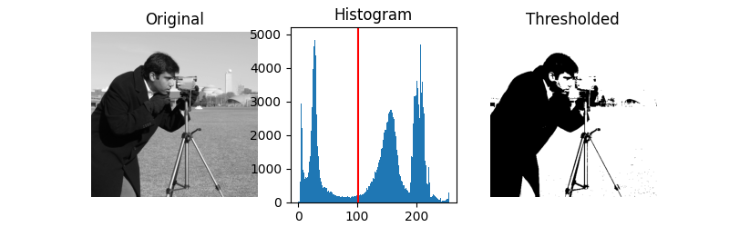

### [Blurring or Smoothing](https://www.tutorialspoint.com/dip/concept_of_blurring.htm)
- is sometimes combined with edge detection
- Gamma Correction: make image brighter or darker
- [Image Kernels](https://setosa.io/ev/image-kernels/): apply filters to images
- [Gaussian Blurring](https://en.wikipedia.org/wiki/Gaussian_blur)

### [Morphological Operator](https://homepages.inf.ed.ac.uk/rbf/HIPR2/morops.htm)
They are kernels(filters) used to improve the image, like: reducing noise

Operations:
- `morphologyEx` : executes all types of morphological operations
- `erode`
- Gradient : allows us to perform operations such as object detection, object tracking and eventually even image classification. The [Sobel](https://en.wikipedia.org/wiki/Sobel_operator) filter is an Edge Detector and is a very common operator.
  
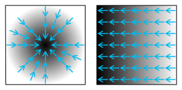

There are a lot of types of [Feature Detection](https://en.wikipedia.org/wiki/Feature_(computer_vision))

### Histogram
Is a visual representation of the distribution of a continuous feature.

**[Histogram Equalization](https://towardsdatascience.com/histogram-equalization-5d1013626e64)** is a method of contrast adjustment based on the image's histogram (increases the image contrast). It transforms the maximum pixel value into 255 and the minimum to 0.


## 4. [Video Basics](https://docs.opencv.org/4.x/dd/d43/tutorial_py_video_display.html)

## 5. Object Detection

### [Template Matching](https://docs.opencv.org/4.x/d4/dc6/tutorial_py_template_matching.html)
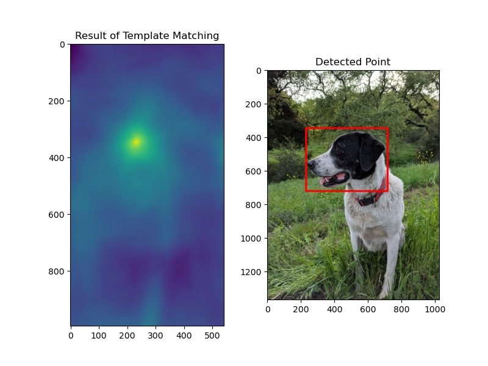

Find an **exact copy of an image** within another larger image. All it does is simply scan a larger image for a provided template by sliding that template target image across the larger image.

The Matching can be done through different [operations](https://docs.opencv.org/4.x/df/dfb/group__imgproc__object.html#ga3a7850640f1fe1f58fe91a2d7583695d).

[**`eval`**](https://towardsdatascience.com/python-eval-built-in-function-601f87db191)

```python
sum([1, 2, 3]) # 6

mystring = "sum"
eval(mystring) # <built-in function sum>
myfunc = eval(mystring)

myfunc([1, 2, 3]) # 6
```

OpenCV **`matchTemplate()`** returns an heat map. 

### Corner Detection
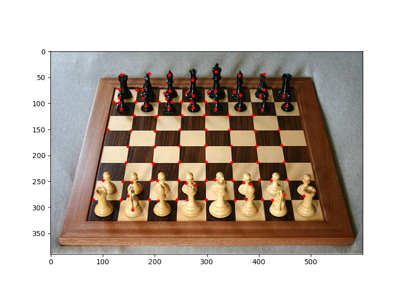

A **corner** is a point who's local neighborhood stands in two dominance and different edge directions. Popular algorithms are:
- [Harris corner detector](https://docs.opencv.org/3.4/dc/d0d/tutorial_py_features_harris.html) : `cornerHarris()`
- [Shi-Tomasi Corner Detection & Good Features to Track](https://docs.opencv.org/4.x/d4/d8c/tutorial_py_shi_tomasi.html) : ``

### Edge Detection
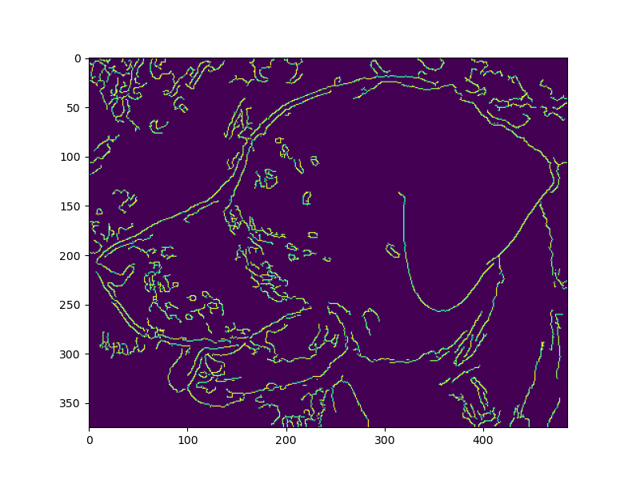

Finding Edges of objects. The most common algorithm is the [Canny Edge Detector](https://docs.opencv.org/3.4/da/d22/tutorial_py_canny.html) `Canny()`.

### Grid Detection
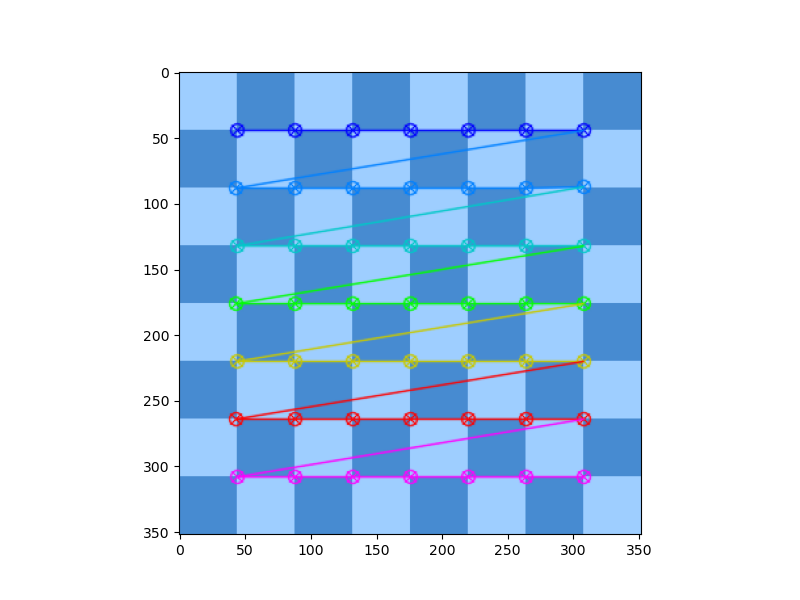

Are often used to calibrate cameras and track motion.

`findChessboardCorners()` 

`findCirclesGrid()`

### [Contour Detection](https://learnopencv.com/contour-detection-using-opencv-python-c/)
|          Input           |         External Contours         |         Internal Contours         |
| :----------------------: | :-------------------------------: | :-------------------------------: |
|  | 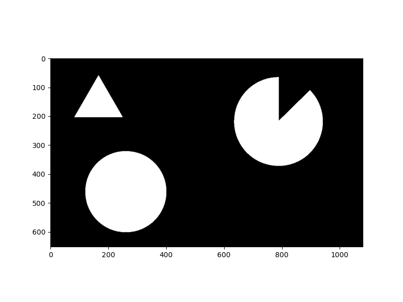 | 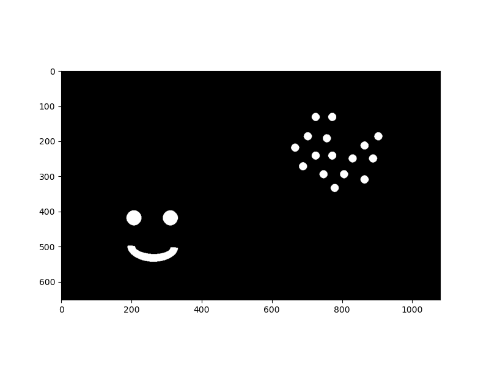 |

Contours are defined as a curve, joining all the continuous points along the boundary, having the same color or same intensity. They are useful for shape analysis and object detection and recognition.

It is also used to detect foreground VS background images and also differentiate between external and internal contours.

`findContours()` 

`drawContours()`

### [Feature Matching](https://docs.opencv.org/4.x/dc/dc3/tutorial_py_matcher.html)
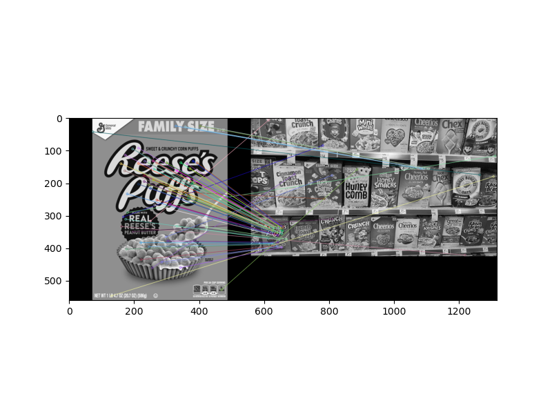

Detecting matching objects in another image. 

Feature matching extracts defining key features from an input image and then using a distance calculation finds all the matches in a secondary image.

Some methods are:
- Brute-Force Matching with ORB Descriptors :
  ```
  BFMatcher(cv.NORM_HAMMING, crossCheck=True)
  drawMatches(...)
  ```
- Brute-Force Matching with SIFT Descriptors and Ratio Test : Works well with images that have a different scale.
  ```
  BFMatcher()
  knnMatch(...)
  drawMatchesKnn(...)
  ```
- FLANN based Matcher : Is much faster than brute force matcher, but it only finds approximate nearest neighbors, which is good matching, but not necessarily the best.
  ```
  FlannBasedMatcher(...)
  knnMatch(...)
  drawMatchesKnn(...)
  ```

### [Watershed Algorithm](https://docs.opencv.org/4.x/d3/db4/tutorial_py_watershed.html)
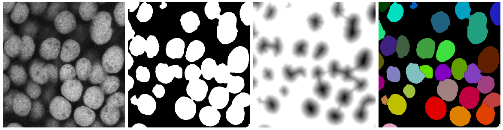


Used to **Segment images** into foreground and background, and also allow to manually set seeds to choose segments of an image. 

Watershed algorithm operates like a topographic map. Any grayscale image can be viewed as a topographic surface where high intensity denotes peaks and hills, while a low intensity denotes valleys. The algorithm can then feel every isolated valley or the local minimum with different colored water, **generating the different segments**. To avoid the merging of different segments the algorithm creates a barrier.

For this algorithm we need to perform a [**Distance Transform**](https://homepages.inf.ed.ac.uk/rbf/HIPR2/distance.htm).

Steps:
1. Apply Blur
2. Grayscale and Binary Threshold + OTSU
3. Noise Removal
4. Finding sure background area from dilation
5. Finding sure foreground area
6. Finding unknown region
7. Get Markers from connectedComponents(...)
8. Use Markers as input for the Watershed algorithm
9. Get Contours

#### Customized Watershed 
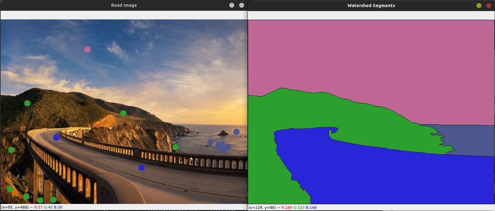

### [Facial and Eye Detection](https://docs.opencv.org/3.4/db/d28/tutorial_cascade_classifier.html)
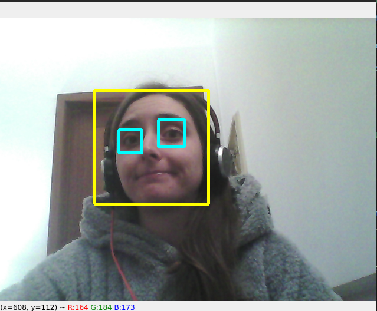

Use **[Viola-Jones algorithm with Haar Cascades](https://towardsdatascience.com/viola-jones-algorithm-and-haar-cascade-classifier-ee3bfb19f7d8)** to detect faces, which has a run time of `O(1)` by using an integral image.  :warning: This is not facial recognition since that requires deep learning.

The main features used on the algorithm are:
- Edge Features
- Line Features
- Four rectangle features 

The person in the feature needs to be facing the camera.

Process:
1. Grayscale image
2. Search for Haar Cascade Features
  1. Edge feature indicating eyes and checks
  2. Line feature indicating the bridge of the nose
  3. Do the same of other parts of the face eye brows, mouth ...
3. Detect the face from the features

You need a very large data set in order to create your own features or classifiers. We will be using some pre-trained classifiers (`.xml` files inside `hardcascades` folder)


