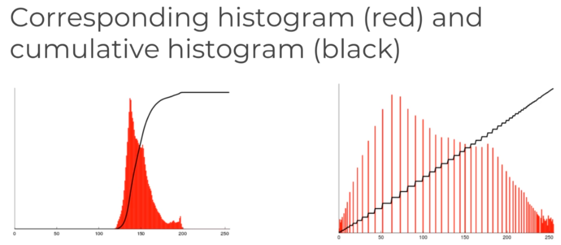

# LearnComputerVision
Learn Computer Vision and Deep Learning in Python.

Course: Udemy Python for Computer Vision with OpenCV and Deep Learning Course

## Prerequisites

1. Install [conda](https://www.anaconda.com/products/individual)
2. Setup the environment with all the necessary packages:
    > conda env create -f cvcourse_linux.yml
3. Activate your newly created environment
    > conda activate python-cvcourse

[Conda Cheat Sheet](https://docs.conda.io/projects/conda/en/4.6.0/_downloads/52a95608c49671267e40c689e0bc00ca/conda-cheatsheet.pdf)

## Content
1. [NumPy and Image Basics](#1-numpy-and-image-basics)
2. [Image Basics with OpenCV](#2-image-basics-with-opencv)
3. [Image Processing](#3-image-processing)
4. [Video Basics](#4-video-basics)
5. [Object Detection](#5-object-detection)
6. [Object Tracking](#6-object-tracking)
7. [Machine Learning](#machine-learning)
8. [Deep Learning](#deep-learning)

# 1. NumPy and Image Basics
[NumPy Docs](https://numpy.org/doc/stable/user/quickstart.html)

`.arrange()`: creates `int`

`.zeros()`: creates `float`

**`PIL`:** lib for Images.

**[Matplotlib:](https://matplotlib.org/stable/)** for plotting images.

# 2. Image Basics with OpenCV


## Differences between Matplotlib and OpenCV

**Matplotlib** : RGB (RED, GREEN, BLUE)

**OpenCV** : BGR (BLUE, GREEN, RED)

# 3. Image Processing


**Color Mappings**

|         RGB         |         HSL         |         HSV         |
| :-----------------: | :-----------------: | :-----------------: |
|  |  |  |


## [Adding (blending) two images](https://docs.opencv.org/3.4/d5/dc4/tutorial_adding_images.html): 
- `addWeighted` : if images have the same size
- `bitwise_*` : use bitwise functions to combine information of images with different size
  

## [Thresholding](https://docs.opencv.org/4.x/d7/d4d/tutorial_py_thresholding.html): 
Segment an image into different parts. In case of Binary Threshold it's only 2 parts, white and black. [ThresholdTypes](https://docs.opencv.org/4.x/d7/d1b/group__imgproc__misc.html#gaa9e58d2860d4afa658ef70a9b1115576)


## [Blurring or Smoothing](https://www.tutorialspoint.com/dip/concept_of_blurring.htm)
- is sometimes combined with edge detection
- Gamma Correction: make image brighter or darker
- [Image Kernels](https://setosa.io/ev/image-kernels/): apply filters to images
- [Gaussian Blurring](https://en.wikipedia.org/wiki/Gaussian_blur)

## [Morphological Operator](https://homepages.inf.ed.ac.uk/rbf/HIPR2/morops.htm)
They are kernels(filters) used to improve the image, like: reducing noise

Operations:
- `morphologyEx` : executes all types of morphological operations
- `erode`
- Gradient : allows us to perform operations such as object detection, object tracking and eventually even image classification. The [Sobel](https://en.wikipedia.org/wiki/Sobel_operator) filter is an Edge Detector and is a very common operator.
  


There are a lot of types of [Feature Detection](https://en.wikipedia.org/wiki/Feature_(computer_vision))

## Histogram
Is a visual representation of the distribution of a continuous feature.

**[Histogram Equalization](https://towardsdatascience.com/histogram-equalization-5d1013626e64)** is a method of contrast adjustment based on the image's histogram (increases the image contrast). It transforms the maximum pixel value into 255 and the minimum to 0.



# 4. [Video Basics](https://docs.opencv.org/4.x/dd/d43/tutorial_py_video_display.html)

# 5. Object Detection

## [Template Matching](https://docs.opencv.org/4.x/d4/dc6/tutorial_py_template_matching.html)


Find an **exact copy of an image** within another larger image. All it does is simply scan a larger image for a provided template by sliding that template target image across the larger image.

The Matching can be done through different [operations](https://docs.opencv.org/4.x/df/dfb/group__imgproc__object.html#ga3a7850640f1fe1f58fe91a2d7583695d).

[**`eval`**](https://towardsdatascience.com/python-eval-built-in-function-601f87db191)

```python
sum([1, 2, 3]) # 6

mystring = "sum"
eval(mystring) # <built-in function sum>
myfunc = eval(mystring)

myfunc([1, 2, 3]) # 6
```

OpenCV **`matchTemplate()`** returns an heat map. 

## Corner Detection


A **corner** is a point who's local neighborhood stands in two dominance and different edge directions. Popular algorithms are:
- [Harris corner detector](https://docs.opencv.org/3.4/dc/d0d/tutorial_py_features_harris.html) : `cornerHarris()`
- [Shi-Tomasi Corner Detection & Good Features to Track](https://docs.opencv.org/4.x/d4/d8c/tutorial_py_shi_tomasi.html) : ``

## Edge Detection


Finding Edges of objects. The most common algorithm is the [Canny Edge Detector](https://docs.opencv.org/3.4/da/d22/tutorial_py_canny.html) `Canny()`.

## Grid Detection


Are often used to calibrate cameras and track motion.

`findChessboardCorners()` 

`findCirclesGrid()`

## [Contour Detection](https://learnopencv.com/contour-detection-using-opencv-python-c/)
|          Input           |         External Contours         |         Internal Contours         |
| :----------------------: | :-------------------------------: | :-------------------------------: |
|  |  |  |

Contours are defined as a curve, joining all the continuous points along the boundary, having the same color or same intensity. They are useful for shape analysis and object detection and recognition.

It is also used to detect foreground VS background images and also differentiate between external and internal contours.

`findContours()` 

`drawContours()`

## [Feature Matching](https://docs.opencv.org/4.x/dc/dc3/tutorial_py_matcher.html)


Detecting matching objects in another image. 

Feature matching extracts defining key features from an input image and then using a distance calculation finds all the matches in a secondary image.

Some methods are:
- Brute-Force Matching with ORB Descriptors :
  ```
  BFMatcher(cv.NORM_HAMMING, crossCheck=True)
  drawMatches(...)
  ```
- Brute-Force Matching with SIFT Descriptors and Ratio Test : Works well with images that have a different scale.
  ```
  BFMatcher()
  knnMatch(...)
  drawMatchesKnn(...)
  ```
- FLANN based Matcher : Is much faster than brute force matcher, but it only finds approximate nearest neighbors, which is good matching, but not necessarily the best.
  ```
  FlannBasedMatcher(...)
  knnMatch(...)
  drawMatchesKnn(...)
  ```

## [Watershed Algorithm](https://docs.opencv.org/4.x/d3/db4/tutorial_py_watershed.html)


Used to **Segment images** into foreground and background, and also allow to manually set seeds to choose segments of an image. 

Watershed algorithm operates like a topographic map. Any grayscale image can be viewed as a topographic surface where high intensity denotes peaks and hills, while a low intensity denotes valleys. The algorithm can then feel every isolated valley or the local minimum with different colored water, **generating the different segments**. To avoid the merging of different segments the algorithm creates a barrier.

For this algorithm we need to perform a [**Distance Transform**](https://homepages.inf.ed.ac.uk/rbf/HIPR2/distance.htm).

Steps:
1. Apply Blur
2. Grayscale and Binary Threshold + OTSU
3. Noise Removal
4. Finding sure background area from dilation
5. Finding sure foreground area
6. Finding unknown region
7. Get Markers from connectedComponents(...)
8. Use Markers as input for the Watershed algorithm
9. Get Contours

### Customized Watershed 


## [Facial and Eye Detection](https://docs.opencv.org/3.4/db/d28/tutorial_cascade_classifier.html)


Use **[Viola-Jones algorithm with Haar Cascades](https://towardsdatascience.com/viola-jones-algorithm-and-haar-cascade-classifier-ee3bfb19f7d8)** to detect faces, which has a run time of `O(1)` by using an integral image.  :warning: This is not facial recognition since that requires deep learning.

The main features used on the algorithm are:
- Edge Features
- Line Features
- Four rectangle features 

The person in the feature needs to be facing the camera.

Process:
1. Grayscale image
2. Search for Haar Cascade Features
  1. Edge feature indicating eyes and checks
  2. Line feature indicating the bridge of the nose
  3. Do the same of other parts of the face eye brows, mouth ...
3. Detect the face from the features

You need a very large data set in order to create your own features or classifiers. We will be using some pre-trained classifiers (`.xml` files inside `hardcascades` folder)

[`CascadeClassifier(*.xml)`](https://docs.opencv.org/3.4/d1/de5/classcv_1_1CascadeClassifier.html) : read cascade data from xml

`cascade_classifier.detectMultiScale(...)` : find object from the classifiers


# 6. Object Tracking
## [Optical Flow](https://docs.opencv.org/3.4/d4/dee/tutorial_optical_flow.html)
Pattern of apparent motion of image objects between two consecutive frames caused by the movement of object or camera.

Optical flow assumptions:
- The pixel intensities of an object do not change between consecutive frames.
- Neighbouring pixels have similar motion.

First we use **object detection** then we track the object.

Methods used by OpenCV:
- **Lucas-Kanade method**: only tracks the points which it was told to track (sparse feature set).


- **Dense Optical Flow**: calculates flow for all points in an image. The output flow is direction vector that contains magnitude and angle information.


## [MeanShift and CAMShift Tracking](https://docs.opencv.org/3.4/d7/d00/tutorial_meanshift.html)

Used for face tracking.

**MeanShift** is used to locate the maxima of density. Is used for object tracking by creating a confidence map in the new image based on the color histogram of the object in the previous image, and use mean shift to find the peak of a confidence map near the object's old position. The confidence map is a probability density function on the new image, assigning each pixel of the new image a probability, which is the probability of the pixel color occurring in the object in the previous image.

MeanShift does not change the window size  but we can use CAMShift for that purpose since it updates the window size.


These do not work very well.

## Other Tracking APIs
|             Tracker Name              |                                                                Description                                                                |                             Pros                              |                                            Cons                                            |
| :-----------------------------------: | :---------------------------------------------------------------------------------------------------------------------------------------: | :-----------------------------------------------------------: | :----------------------------------------------------------------------------------------: |
|               BOOSTING                |                                     Uses AdaBoost Algorithm. Evaluation occurs across multiple frames                                     |                         well studied                          |                           does not know when tracking has failed                           |
|   Multiple Instance Learning (MIL)    |                                        Similar to Boosting but considers a neighborhood of points                                         |              does not drift as much as Boosting               | does not always report that tracking has failed and does not recover from full obstruction |
| Kernelized Correlation Filters (KCF)  |                Similar to MIL but uses data of points that will overlap which leads to a more accurate and faster tracking                |                    better than MIL and KCF                    |                           does not recover from full obstruction                           |
| Tracking Learning and Detection (TLD) | It localizes all appearances that have been observed so far and corrects the tracker if needed based on errors detected from the learning | works well with obstructions and under large changes in scale |                              can provide many false positives                              |
|               MediaFlow               |                    Tracks the objects both in forward and backward directions and measures descrepancies between both                     | very good at reporting failed tracking and predictable motion |                               fails for fast moving objects                                |


# Machine Learning

The [MNIST](http://yann.lecun.com/exdb/mnist/) database is the most common database of handwritten digits.

The [CIFAR-10](https://www.cs.toronto.edu/~kriz/cifar.html) database is a common database of images in RGB.

The [COCO](https://cocodataset.org/#home) database is a large-scale object detection, segmentation, and captioning dataset

# Deep Learning

## Neurons
`perceptron:` artificial neuron


## Neural Networks

3 different layers:
- Input Layers
- Hidden Layers : with 3 or more it's considered a deep network
- Output layers 

**[Activation function](https://en.wikipedia.org/wiki/Activation_function)** of a node defines the output of that node given an input or set of inputs. There are a lot of activation functions and **ReLu** and **tanh** tend to have the best performance.


## Cost Functions

Are used to measure how far off we are from the expected value.

**Gradient decent** is an optimization algorithm for finding the minimum of a function.

**Backpropagation** is used to calculate the error contribution of each neuron after a batch of data is processed. It works by calculating the error at the output and then distributes back through the network layers.

## Convolution Neural Networks (CNNs)

CNN in mostly used for analyzing images.

[Understanding Deep Learning: DNN, RNN, LSTM, CNN and R-CNN](https://medium.com/@sprhlabs/understanding-deep-learning-dnn-rnn-lstm-cnn-and-r-cnn-6602ed94dbff)


**Tensor:** N-dimensional array [[[1,2], [3,4]] , [[5,6], [7,8]]]

They can be used to feed sets of images into the model with the following format: (I, H, W, C)
- I: images
- H: image height in pixels
- W: image width in pixels
- C: Color channels 1-Grayscale, 3-RGB 

**Convolutions and Filters**

Each filter detects a single feature.

**1D Convolution Network:**

|           1 Filter Stride of 1           |           1 Filter Stride of 2           |           2 Filters Stride of 2           |
| :--------------------------------------: | :--------------------------------------: | :---------------------------------------: |
|  |  |  |

**1D Convolution Network with multiple filters:**


**Filter applied to an image with different strides:**

|    Filter with Stride of 1     |    Filter with Stride of 2     |
| :----------------------------: | :----------------------------: |
|  |  |

**Padding**


**Pooling Layers** will subsample the input image, which reduces the memory use and computer load as well as reducing the number of parameters. With a pooling layer we remove a lot of information of the input data (ex: 2x2 kernel with a stride of 2 will remove 75% of the input data). Generating a pooling layer:


**Dropout** is a form of regularization to help prevent overfitting.

**Common CNN architectures:**
- LeNet-5
- AlexNet
- GoogleNet
- ResNet

:warning: If you have a poor accuracy in your test data but really good on the training set that means you're probably overfitting to the training set.

## YOLO (You Only Look Once)
Image detection algorithm which can view an image and draw bounding boxes over what it perceives as identified classes.

First it only applies a single neural network.Then this network divides the image into regions and predicts bounding boxes and probabilities for each region. So that actual division is happening within the neural network so that it only needs to view the image one time. And then these bounding boxes are weighted by the predicted probabilities. 

It's 100x faster than Fast R-CNN.


